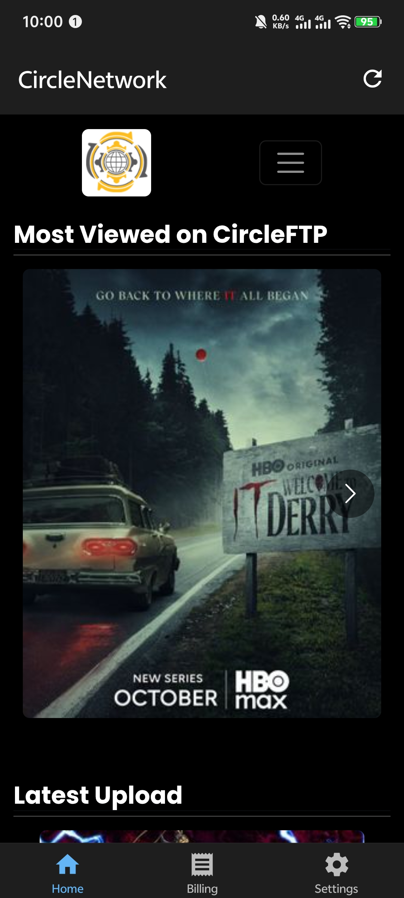
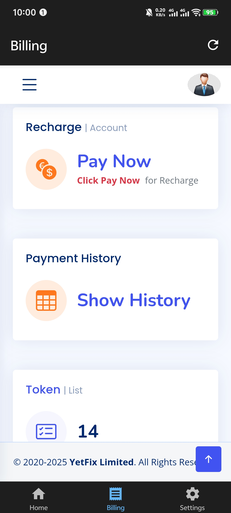
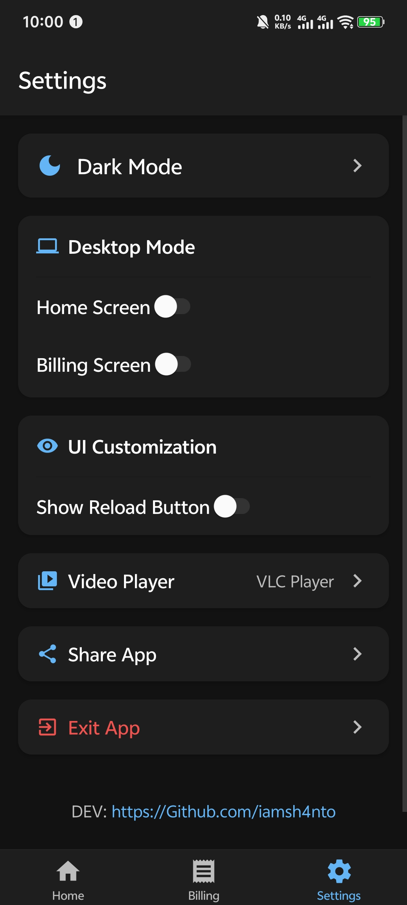
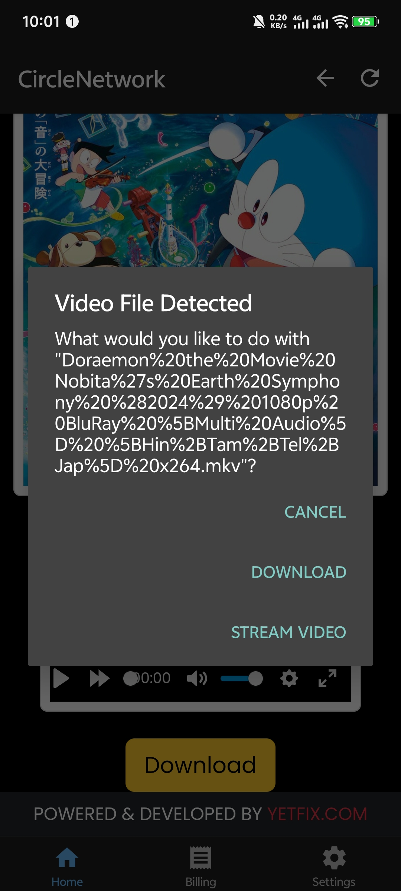

# CircleNetwork - Expo React Native App

A full-featured Expo React Native application with WebViews, theme settings, file downloads, and custom splash screen.

## Features

- ✅ **3 Screens**: Home, Billing, and Settings
- ✅ **WebView Integration**: Desktop mode for Home, Mobile mode for Billing
- ✅ **Theme Support**: Dark/Light mode with persistence
- ✅ **Custom Splash Screen**: CircleNetwork branding
- ✅ **Pull-to-Refresh**: On both WebView screens
- ✅ **Offline Detection**: Shows message when network is unavailable
- ✅ **Share Functionality**: Share current page URL and app
- ✅ **Download Support**: File download handling
- ✅ **Video Streaming**: Stream videos in external players (VLC, MX Player, etc.)
- ✅ **Player Selection**: Choose and remember your preferred video player
- ✅ **Modern UI**: Material Design icons and smooth transitions

## Screenshots

Below are screenshots of the app showcasing its various features and screens:

| Splash Screen | Home Screen | Billing Screen | Settings Screen | Stream Menu |
|:---:|:---:|:---:|:---:|:---:|
|  |  |  |  |  |

## Tech Stack

- **Expo SDK 54** - Latest stable version
- **TypeScript** - Type-safe development
- **React Navigation** - Bottom tab navigation
- **react-native-webview** - WebView component
- **Zustand** - State management
- **AsyncStorage** - Local data persistence
- **NetInfo** - Network status detection
- **Expo Splash Screen** - Custom splash screen
- **Material Icons** - Modern icon set

## Project Structure

```
CircleNetwork/
├── src/
│   ├── components/
│   │   ├── CustomWebView.tsx      # Reusable WebView component
│   │   └── SplashScreen.tsx       # Custom splash screen
│   ├── context/
│   │   └── ThemeContext.tsx       # Theme provider
│   ├── navigation/
│   │   └── Navigation.tsx         # Bottom tab navigation
│   ├── screens/
│   │   ├── HomeScreen.tsx         # Home screen (Desktop mode)
│   │   ├── BillingScreen.tsx      # Billing screen (Mobile mode)
│   │   ├── SettingsScreen.tsx     # Settings screen
│   │   └── VideoPlayerScreen.tsx # External video player
│   ├── store/
│   │   └── SettingsStore.ts       # Zustand store
│   ├── utils/
│   │   ├── WebViewUtils.ts        # WebView utilities
│   │   └── MediaUtils.ts         # Media file utilities
│   └── types.ts                   # TypeScript types
├── App.tsx                        # App entry point
├── app.json                       # Expo configuration
└── package.json                   # Dependencies

```

## Setup Instructions

### Prerequisites

- Node.js (v18 or higher)
- npm or yarn
- Expo CLI
- iOS Simulator (for iOS development) or Android Studio (for Android development)

### Installation

1. **Clone or navigate to the project directory**:

   ```bash
   cd /Users/shanto/Documents/Projects/CircleNetwork
   ```

2. **Install dependencies** (already done):

   ```bash
   npm install
   ```

3. **Start the development server**:

   ```bash
   npx expo start
   ```

4. **Run on device/simulator**:
   - Press `i` for iOS simulator
   - Press `a` for Android emulator
   - Scan QR code with Expo Go app for physical device

## Video Streaming

The app now supports streaming videos in external players:

1. **Player Selection**: Choose your preferred video player (VLC, MX Player, or System Player)
2. **Persistent Choice**: Your selection is remembered for future videos
3. **Change Anytime**: Update your preferred player in Settings
4. **Supported Players**:
   - VLC Player
   - MX Player
   - System Default Player

## Download Handling

The app includes download functionality with the following behavior:

1. **Folder Selection**: Users can select a download folder in Settings
2. **Download Trigger**: When a download is triggered in the WebView, the file URL is opened using the system's default handler
3. **Android Support**: Downloads work on Android using the system download manager
4. **iOS Support**: Downloads open in the default browser/handler

**Note**: Due to platform limitations, the current implementation uses the system's default download handler. For advanced download features with custom folder selection, additional native modules may be required.

## Permissions

### Android

- `INTERNET` - Required for WebView and network access
- `ACCESS_NETWORK_STATE` - Required for offline detection

### iOS

- Network access is enabled by default

Permissions are configured in `app.json`.

## Theme System

The app supports both light and dark themes:

- **Light Theme**: White background, dark text
- **Dark Theme**: Dark background, light text
- **Persistence**: Theme preference is saved using AsyncStorage
- **Toggle**: Users can switch themes in Settings

Theme colors are defined in `src/context/ThemeContext.tsx`.

## Customization

### Changing URLs

Edit the screen files to change WebView URLs:

- **Home**: `src/screens/HomeScreen.tsx` - Line with `url="http://new.circleftp.net/"`
- **Billing**: `src/screens/BillingScreen.tsx` - Line with `url="https://billing.circlenetworkbd.net/"`

### Changing Colors

Edit theme colors in `src/context/ThemeContext.tsx`:

```typescript
const lightTheme: Theme = {
  colors: {
    background: "#FFFFFF",
    primary: "#2196F3",
    // ... other colors
  },
};
```

### Changing App Name

1. Edit `app.json`:

   ```json
   {
     "expo": {
       "name": "YourAppName",
       "slug": "yourappname"
     }
   }
   ```

2. Edit `src/components/SplashScreen.tsx` to change splash screen text

## Troubleshooting

### WebView not loading

- Check internet connection
- Verify URLs are correct and accessible
- Check console for errors

### Theme not persisting

- Ensure AsyncStorage is working
- Check for errors in console
- Clear app data and restart

### Downloads not working

- Ensure proper permissions are granted
- Check if URL is a valid download link
- Verify network connection

### Build errors

- Clear cache: `npx expo start -c`
- Delete `node_modules` and reinstall: `rm -rf node_modules && npm install`
- Update Expo: `npx expo install --fix`

## Development Notes

- The app uses **Expo SDK 54** (latest stable)
- All components are written in **TypeScript** for type safety
- Code follows **clean code principles** with minimal comments
- Security and performance are prioritized
- Server load is minimized through efficient state management

## Developer

**DEV**: [https://Github.com/iamsh4nto](https://Github.com/iamsh4nto)

## License

MIT License - Feel free to use this project for your own purposes.
